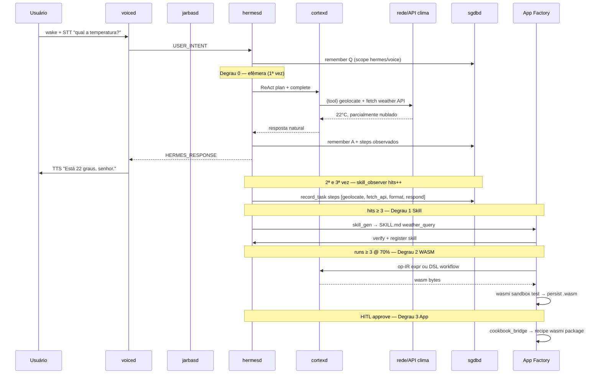

# ADR-010: Runtime App Factory — escada efêmera → skill → WASM → app wasmi

- **Status:** Accepted (revisão 2026-09-02 — alinhamento neural-os-core ADR-0059)
- **Lifecycle:** `fazendo`
- **Ideia:** #010
- **Sprint:** Fase 7 / Onda 7
- **Depende de:** ADR-001 (mand. 2 auto-gerar, mand. 3 memorização), ADR-003 (Jarvis), ADR-006 (Hermes), ADR-007 (Cortex), ADR-002 (userspace)
- **Origem:** neural-os-core [ADR-0059](https://github.com/msrovani/neural-os-core) (`skill_gen`, `skill_opt`, `self_evolve`, `wasm_build`, `wasmi_rt`)
- **Relacionado:** ADR-0052 (artefato skill — referência upstream), ADR-009 (produto v0.1)

---

## Contexto

O RNAIOS materializa o mandamento 2 (*auto-gerar funcionalidades*) e o mandamento 3 (*inferência → adaptação → memorização → aprendizado*).

No **neural-os-core**, uma demanda do usuário **não nasce como WASM**. Ela percorre uma **escada cognitiva**:

1. **Execução efêmera** — ReAct completo (planejar, pesquisar, chamar provedores, responder).
2. **Skill** — após recorrência, vira contrato `SKILL.md` com workflow reproduzível.
3. **WASM** — após runs bem-sucedidos, compila para op-IR/wasm e roda em sandbox wasmi.
4. **App wasmi** — skill madura assinada vira pacote OS (PackageHub / cookbook Redox).

A implementação inicial da Onda 7a–7d **pulou o degrau Skill (SKILL.md)** e promoveu direto para `DynamicSkill` + wasm placeholder. Esta revisão **corrige o modelo alvo** e documenta o gap.

---

## Decisão — escada cognitiva (paridade ADR-0059)

| Degrau | Nome | Runtime | Gatilho | Artefato |
|--------|------|---------|---------|----------|
| **0** | **Efêmera** | ReAct + Cortex + tools (rede, APIs) | 1ª execução (e 2ª) | Memória SGDB (Q/A, steps observados) |
| **1** | **Skill** | Hermes executa workflow `SKILL.md` | `hits ≥ 3` no mesmo intent normalizado | `SKILL.md` (schema ADR-0052) |
| **2** | **WASM** | `wasm-skill-runtime` (wasmi + fuel + CapGate) | `runs ≥ 3` e `success_rate ≥ 0.7` | `.wasm` em `/var/lib/aios/skills/` |
| **3** | **App wasmi** | Pacote OS + wasmi_cli (recipe Redox) | HITL + skill madura + assinatura | `recipes/aios/skills/{name}/` |

Caminhos B (Cranelift JIT) e C (Rust nativo Ring3) permanecem **gated** (`AWAITING_ISOLATION`) — não portar sem isolamento Redox real.

### O que NÃO é efêmera

- Builtin Rust (`/time`, `/echo`) — estática, não evolui.
- Resposta stub do Cortex sem workflow — degradada, mas ainda memorizada para aprendizado futuro.

### O que É efêmera

- Qualquer intent de chat/voz **sem skill registrada**: Hermes roda ciclo ReAct completo, Cortex raciocina, (futuro) tools de rede consultam provedores externos, resposta volta por TTS.

---

## Exemplo canônico — *"Jarbas, qual a temperatura?"*

Fluxo alvo ponta-a-ponta (voz + inteligência + aprendizado + promoção):



### Degrau 0 — 1ª vez (efêmera)

| Passo | Componente | Ação |
|-------|------------|------|
| 1 | `voiced` | STT → texto |
| 2 | `hermesd` | `observe_intent` (hits=1), ReAct trace |
| 3 | `cortexd` | Planeja: preciso de localização + provedor clima |
| 4 | *(tool)* `fetch_external` | HTTP/API — stub honesto; `REDOX_TOOLS_NET=1` para providers plugados |
| 5 | `cortexd` | Formata resposta natural PT-BR |
| 6 | `sgdbd` | `remember("Q:temp? A:22°C steps:geolocate,fetch,format")` |
| 7 | `voiced` | TTS resposta |

**Sem skill registrada.** Tudo via LLM + tools. Latência maior, mas funciona na primeira pergunta.

### Degrau 1 — recorrência → Skill (`hits ≥ 3`)

Após a mesma intent normalizada (`qual_a_temperatura`) ser feita **3 vezes**:

- `skill_observer` + `skill_gen::record_task` acumulam workflow observado.
- `self_evolve::auto_generate_pending` gera `SKILL.md`:

```yaml
---
schema: 1
kind: skill
name: weather_query
description: Consulta temperatura atual via API de clima
contexto: "Intent recorrente sobre temperatura/tempo"
acionaveis: ["on_demand"]
provenance: hermes_created
sandbox_status: none
---

## Workflow
1. Extrair localização (GPS/IP/perfil SGDB)
2. Consultar provedor clima (Open-Meteo)
3. Formatar resposta PT-BR
4. Publicar HERMES_RESPONSE + TTS
```

- Hermes passa a **rotear** `/weather_query` ou match NL → executar workflow documentado (não ReAct livre).

### Degrau 2 — runs maduros → WASM (`runs ≥ 3`, `rate ≥ 0.7`)

- `skill_opt` detecta skill estável.
- `cortexd` + `wasm_gen` emitem **op-IR** restrita (gramática #412 upstream):

  ```text
  op-ir: provider_fetch(lat, lon)  # futuro: host import aios_net
  ```

  Hoje (Onda 7g): expressões aritméticas puras; workflows com rede usam host imports `aios::*` gated.

- `wasm-skill-runtime` testa em sandbox wasmi → `persist_wasm` → `/var/lib/aios/skills/weather_query.wasm`.

### Degrau 3 — HITL → App wasmi (pacote OS)

- Operador: `/promote weather_query approve`
- `cookbook_bridge` gera recipe em `recipes/aios/skills/weather_query/`
- `pkgutils` instala em `/usr/lib/aios/skills/weather_query.wasm`
- Recipe `wasmi` (Onda 7e) fornece `wasmi_cli` no target para validação.

---

## Pipeline implementação RNAIOS

```text
VOICE/TEXT intent
  → skill_observer (hits++, SGDB usage log)
  → [Degrau 0] HermesRouter ReAct → cortexd (+ tools rede futuro)
  → sgdbd remember (Q/A + steps)
  → [Degrau 1] skill_gen → SKILL.md → SkillRegistry (✅ Onda 7h)
  → [Degrau 2] wasm_gen (op-IR) → wasmi test → persist .wasm (🟡 Onda 7g)
  → [Degrau 3] cookbook_bridge + HITL → recipe (⏳ Onda 7f)
```

### Crates / módulos

| Módulo | Degrau | Papel |
|--------|--------|-------|
| `voice-core/pipeline` | 0 | STT → Hermes → TTS |
| `hermes-core/router` | 0–1 | ReAct, roteamento skill/WASM |
| `hermes-core/skill_observer` | 0–1 | Recorrência / normalização |
| `hermes-core/skill_gen` *(novo)* | 1 | `TaskPattern` → `SKILL.md` |
| `hermes-core/self_evolve` | 1–2 | observe → generate → verify → promote |
| `hermes-core/wasm_gen` | 2 | op-IR / cortex → wasm bytes |
| `wasm-skill-runtime/op_ir` | 2 | Montador op-IR → wasm |
| `skill-registry/dynamic` | 2 | `DynamicSkill`, thresholds, persist |
| `hermes-core/skill_opt` | 2 | efêmera/skill → WASM file |
| `hermes-core/cookbook_bridge` | 3 | recipe Redox + HITL |
| `hermes-core/app_factory` | 2–3 | Seletor Caminho A + gates B/C |

### Limiares (paridade neural-os-core)

| Gatilho | Valor | Referência upstream |
|---------|-------|---------------------|
| Observação → candidato skill | `hits ≥ 3` | `skill_gen::maybe_auto_skill` |
| Skill → WASM file | `runs ≥ 3` e `success_rate ≥ 0.7` | `skill_opt::maybe_promote_to_wasm` |
| WASM → pacote OS | HITL explícito | `package_hub` + ADR-0052 |

---

## Gap — implementação atual vs alvo

| Degrau | Alvo | Estado RNAIOS (2026-09-02) |
|--------|------|----------------------------|
| 0 Efêmera | ReAct + Cortex + tools + SGDB | 🟡 ReAct + Cortex stub; SGDB remember OK; **sem tool rede clima** |
| 1 Skill | `SKILL.md` registrável | ✅ Onda 7h |
| 2 WASM | op-IR real + wasmi | 🟡 wasmi OK; op-IR parcial; placeholder se parse falha |
| 3 App | cookbook + wasmi recipe | ⏳ bridge parcial; recipe wasmi promovida (7e) |

**Correção prioritária (Onda 7h):** introduzir `skill_gen` + registro `SKILL.md` **antes** de emitir WASM.

---

## Integração Jarbas / voz (ADR-003)

Todo utterance de voz passa pelo mesmo pipeline:

```text
jarbasd → voiced:7744 → hermesd:7742 → [escada acima] → voiced TTS → jarbasd HUD
```

`DataCollector` grava pares no SGDB scope `voice` — alimenta recorrência e fine-tuning futuro.

---

## Variáveis de ambiente

| Var | Default | Uso |
|-----|---------|-----|
| `REDOX_SKILLS_DIR` | `/var/lib/aios/skills` | WASM persistido |
| `REDOX_FACTORY_CAPS` | `1` | Host imports WASM (`aios::log`, etc.) |
| `REDOX_RECIPES_STAGING` | `recipes/aios/skills` | Staging cookbook (7f) |
| `REDOX_HERMES_HITL` | `1` | Gate promoção pacote OS |

---

## Apreciação ADR-001

| Mandamento | Como esta ADR atende |
|------------|---------------------|
| 2 auto-gerar | Escada efêmera → skill → wasm → app |
| 3 memorização | SGDB em cada degrau; steps observados |
| 4 backends honestos | Caminho A wasmi reportado; B/C gated |
| HITL | Promoção pacote OS e tools de rede |

---

## Verificação

### Alvo (aceite Fase 7)

- [ ] **E2E clima:** 1ª pergunta efêmera responde (stub ou API real)
- [ ] 3× mesma pergunta → `SKILL.md weather_query` registrada
- [ ] Skill madura → `.wasm` executa em wasmi
- [ ] `/promote weather_query approve` → recipe staged
- [ ] Demo gravável: voz → resposta → 3ª repetição usa skill (não ReAct livre)

### Entregue (Onda 7a–7g parcial)

- [x] ADR-010 revisada (escada + exemplo clima)
- [x] `wasm-skill-runtime` + wasmi self-test `add(2,3)=5`
- [x] `skill_observer` + `self_evolve` (sem SKILL.md ainda)
- [x] `DynamicSkill` + promoção file
- [x] `wasm_gen` + `op_ir` parcial
- [x] Recipe wasmi overlay (7e)
- [x] `cookbook_bridge` (7f parcial)
- [x] `skill_gen` + SKILL.md (7h)
- [x] Pipeline efêmero + tool registry (7i — genérico, providers plugáveis)
- [x] Provider HTTP exemplo `open_meteo` (opt-in `REDOX_TOOLS_NET=1` + `REDOX_TOOLS_PROVIDERS`)
- [x] CapGate → `scheme_caps` + `REDOX_AIOS_CAPS` (Fase 2 host)
- [x] Cookbook `pkgutils_build_command` + `REDOX_COOKBOOK_BUILD=1`
- [x] `demo-qemu.ps1` + guest check script
- [ ] Handler scheme `memory:` open() nativo
- [ ] QEMU E2E escada gravável

### Variáveis — pipeline efêmero (7i)

| Variável | Default | Uso |
|----------|---------|-----|
| `REDOX_TOOLS_NET` | `0` | `1` habilita `fetch_external` via providers |
| `REDOX_TOOLS_PROVIDERS` | *(vazio)* | `open_meteo`, `all`, ou lista CSV |
| `REDOX_RPC_TIMEOUT_MS` | `2000` | timeout TCP cortexd/sgdbd |
| `REDOX_SKILLS_DIR` | `.aios/skills` | persistência SKILL.md + `.wasm` |

Demo escada: `.\tools\demo-ladder.ps1 -WithNet`

---

## Referências

- neural-os-core: ADR-0059, ADR-0052, `skill_gen.rs`, `skill_opt.rs`, `self_evolve.rs`, `wasm_build.rs`
- Redox: `recipes/wip/wasm/wasmi/recipe.toml` → `recipes/aios/wasmi/`
- RNAIOS: ADR-003, ADR-006, ADR-007, ROADMAP Fase 7
